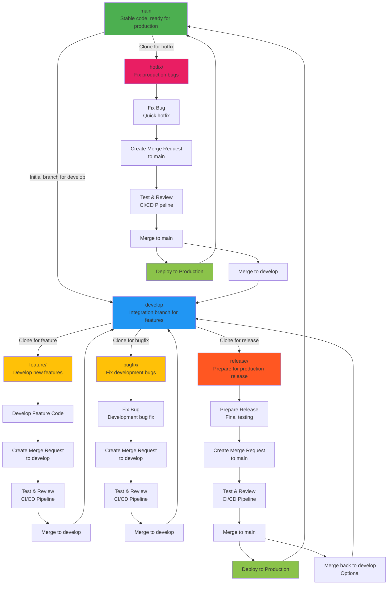

# GitLab Workflow Diagram

This diagram illustrates the GitLab workflow cycle, including branches, merge requests, and the initial branch for each type of request. It follows the Git Flow strategy.

## Flowchart

## Explanation

- **main**: The primary branch with stable, production-ready code. Initial branch for hotfix requests.
- **develop**: Integration branch for new features. Initial branch for feature, bugfix, and release requests.
- **feature/**: Branches cloned from develop for developing new features.
- **bugfix/**: Branches cloned from develop for fixing bugs discovered during development.
- **release/**: Branches cloned from develop for preparing releases.
- **hotfix/**: Branches cloned from main for fixing critical production bugs that require immediate deployment.

## Difference between Hotfix and Bugfix

- **Hotfix**: Used for urgent, critical bugs in production code (main branch). These are high-priority fixes that need to be deployed immediately to production. After fixing, the hotfix is merged back to both main and develop.
- **Bugfix**: Used for bugs found during development or testing in the develop branch. These are typically lower priority and follow the normal development cycle through develop before reaching production.

The main differences are:
- **Priority**: Hotfixes are for production emergencies, bugfixes are for development issues.
- **Source Branch**: Hotfix from main, bugfix from develop.
- **Urgency**: Hotfixes bypass normal release cycles, bugfixes follow the standard process.

This diagram can be customized based on your project's specific needs.