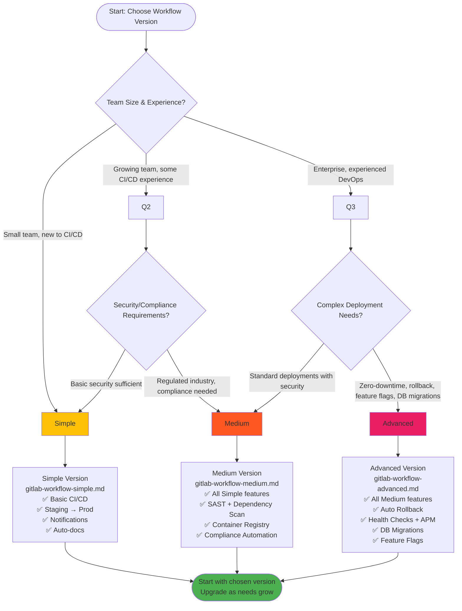

# GitLab Workflow Diagram Repository

This repository contains multiple versions of GitLab workflow diagrams, each with increasing levels of complexity and features. Choose the version that best fits your team's needs.

## Available Versions

### 1. [Simple Version](gitlab-workflow-simple.md)
- **Target Audience**: Teams starting with basic CI/CD
- **Key Features**:
  - Basic Git Flow with main/develop/feature branches
  - Code review and basic CI pipeline (lint + unit tests)
  - Environment progression (staging → production)
  - Stakeholder notifications on deployment
  - Automated documentation updates
- **Use Case**: Simple projects with basic deployment needs
- **Complexity**: Low - suitable for small teams or proof-of-concept projects

### 2. [Medium Version](gitlab-workflow-medium.md)
- **Target Audience**: Teams with security requirements
- **Key Features**:
  - All simple version features
  - Enhanced security scanning (SAST, dependency checks)
  - Compliance automation and license validation
  - Container registry integration (Docker image building/storage)
  - Full security suite for production releases
- **Use Case**: Projects requiring robust security and container management
- **Complexity**: Medium - ideal for regulated industries or growing teams

### 3. [Advanced Version](gitlab-workflow-advanced.md)
- **Target Audience**: Enterprise teams with complex deployments
- **Key Features**:
  - All medium version features
  - Automated rollback procedures for failed deployments
  - Health checks and monitoring integration
  - Performance monitoring (APM + metrics collection)
  - Database migration management
  - Feature flag management for controlled releases
  - Comprehensive alerting and stakeholder communication
- **Use Case**: Large-scale applications with advanced DevOps practices
- **Complexity**: High - designed for enterprise environments with complex requirements

### Original/Base Version
- The original diagram is available in [`gitlab-workflow-original.md`](gitlab-workflow-original.md)
- This serves as the foundation for all enhanced versions

## How to Choose a Version

- **Start Simple**: Begin with the simple version and add features as your team grows
- **Security First**: Use medium version if compliance and security are priorities
- **Full Automation**: Adopt advanced version for complete CI/CD automation and monitoring

Each version includes Mermaid diagrams that can be viewed directly in GitLab or rendered in documentation tools.

## 📖 **Quick Start**

1. Choose your complexity level based on your team's needs
2. Open the corresponding `.md` file
3. View the Mermaid diagram in GitLab or any Markdown renderer
4. Follow the step-by-step explanations for implementation
5. Review [Best Practices & Guidelines](BEST_PRACTICES.md) for security, performance, and compliance

## 🤝 **Contributing**

We welcome contributions! Please see our [Contributing Guidelines](CONTRIBUTING.md) for details.

## 📄 **License**

This project is licensed under the MIT License - see the [LICENSE](LICENSE) file for details.

## 📋 **Resources**

- 📚 **Best Practices**: [Security, Performance & Compliance Guidelines](BEST_PRACTICES.md)
- 📖 **Documentation**: [GitHub Pages](https://mdastpak.github.io/git-workflow-diagram-repo/)
- 🔗 **GitLab CI/CD Docs**: [Official Documentation](https://docs.gitlab.com/ee/ci/)
- 🎯 **Examples**: [Ready-to-use CI/CD Templates](examples/README.md)

## 🎯 **Version Comparison Matrix**

| Feature | Simple | Medium | Advanced |
|---------|--------|--------|----------|
| **Git Flow Branching** | ✅ | ✅ | ✅ |
| **Code Review** | ✅ | ✅ | ✅ |
| **Lint + Unit Tests** | ✅ | ✅ | ✅ |
| **Staging Deployment** | ✅ | ✅ | ✅ |
| **Production Deployment** | ✅ | ✅ | ✅ |
| **Stakeholder Notifications** | ✅ | ✅ | ✅ |
| **Automated Documentation** | ✅ | ✅ | ✅ |
| **SAST Scanning** | ❌ | ✅ | ✅ |
| **Dependency Scanning** | ❌ | ✅ | ✅ |
| **Container Registry** | ❌ | ✅ | ✅ |
| **Container Scanning** | ❌ | ✅ | ✅ |
| **License Compliance** | ❌ | ✅ | ✅ |
| **Compliance Automation** | ❌ | ✅ | ✅ |
| **Integration Tests** | ❌ | ✅ | ✅ |
| **Performance Tests** | ❌ | ❌ | ✅ |
| **Health Checks** | ❌ | ❌ | ✅ |
| **APM / Metrics** | ❌ | ❌ | ✅ |
| **Database Migrations** | ❌ | ❌ | ✅ |
| **Feature Flags** | ❌ | ❌ | ✅ |
| **Automated Rollback** | ❌ | ❌ | ✅ |
| **Blue-Green Deploy** | ❌ | ❌ | ✅ |
| **Multi-arch Docker** | ❌ | ❌ | ✅ |

## 🗺️ **Decision Guide: Which Version to Choose?**

```mermaid
flowchart TD
    Start([Start: Choose Workflow Version]) --> Q1{Team Size & Experience?}
    Q1 -->|Small team, new to CI/CD| Simple
    Q1 -->|Growing team, some CI/CD experience| Q2
    Q1 -->|Enterprise, experienced DevOps| Q3
    
    Q2 --> Q2a{Security/Compliance Requirements?}
    Q2a -->|Regulated industry, compliance needed| Medium
    Q2a -->|Basic security sufficient| Simple
    
    Q3 --> Q3a{Complex Deployment Needs?}
    Q3a -->|Zero-downtime, rollback, feature flags, DB migrations| Advanced
    Q3a -->|Standard deployments with security| Medium
    
    Simple --> S1[Simple Version<br/>gitlab-workflow-simple.md<br/>✅ Basic CI/CD<br/>✅ Staging → Prod<br/>✅ Notifications<br/>✅ Auto-docs]
    Medium --> M1[Medium Version<br/>gitlab-workflow-medium.md<br/>✅ All Simple features<br/>✅ SAST + Dependency Scan<br/>✅ Container Registry<br/>✅ Compliance Automation]
    Advanced --> A1[Advanced Version<br/>gitlab-workflow-advanced.md<br/>✅ All Medium features<br/>✅ Auto Rollback<br/>✅ Health Checks + APM<br/>✅ DB Migrations<br/>✅ Feature Flags]
    
    S1 --> End([Start with chosen version<br/>Upgrade as needs grow])
    M1 --> End
    A1 --> End
    
    style Simple fill:#FFC107
    style Medium fill:#FF5722
    style Advanced fill:#E91E63
    style End fill:#4CAF50
```

## 📞 **Support**

- 📧 **Issues**: [GitHub Issues](https://github.com/mdastpak/git-workflow-diagram-repo/issues)
- 💬 **Discussions**: [GitHub Discussions](https://github.com/mdastpak/git-workflow-diagram-repo/discussions)
- ❓ **Q&A**: Check [Best Practices](BEST_PRACTICES.md) first

---

⭐ **Star this repository** if you find it helpful! Your support helps others discover these workflow diagrams.