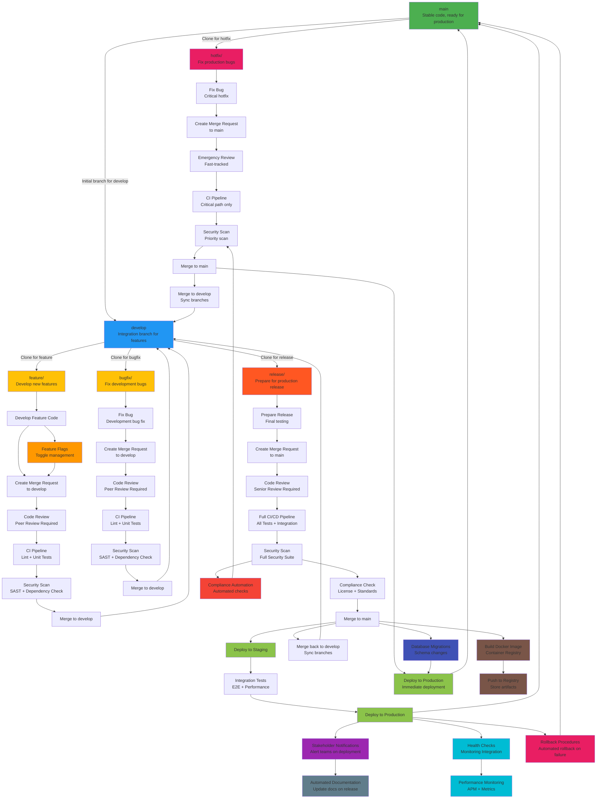

# GitLab Workflow Diagram - Advanced Version

This is the advanced version, incorporating all suggested improvements including automated rollback procedures, monitoring integration, performance monitoring, database migrations, and feature flags.

## Comprehensive Flowchart with All Enhancements

## Key Additions in Advanced Version
- **Rollback Procedures**: Automated rollback for failed deployments
- **Monitoring Integration**: Health checks and alerting
- **Performance Monitoring**: APM and metrics collection
- **Database Migrations**: Automated schema change management
- **Feature Flags**: Feature toggle management for controlled releases
## Step-by-Step Workflow Explanation

### Branch Management
1. **A (main)**: Production branch containing stable, deployable code ready for production use.
2. **B (develop)**: Integration branch where features and bug fixes are merged before release.
3. **C (feature/)**: Branch for developing new features, cloned from develop.
4. **V (bugfix/)**: Branch for fixing bugs in development, cloned from develop.
5. **D (release/)**: Branch for preparing code for production release, cloned from develop.
6. **E (hotfix/)**: Branch for critical production fixes, cloned directly from main.

### Feature Development Flow
7. **F (Develop Feature Code)**: Write and test new feature code in the feature branch.
8. **UUU (Feature Flags - Toggle management)**: Implement feature flags for controlled feature rollout.
9. **G (Create Merge Request to develop)**: Submit code for review to merge into develop branch.
10. **H (Code Review - Peer Review Required)**: Team members review code for quality and standards.
11. **I (CI Pipeline - Lint + Unit Tests)**: Automated checks for code style and basic functionality.
12. **J (Security Scan - SAST + Dependency Check)**: Static application security testing and dependency vulnerability scanning.
13. **K (Merge to develop)**: Approved code is merged into develop branch.

### Bug Fix Flow
14. **W (Fix Bug - Development bug fix)**: Implement fix for development-related bugs.
15. **X (Create Merge Request to develop)**: Submit bug fix for review.
16. **Y (Code Review - Peer Review Required)**: Code review process for bug fixes.
17. **Z (CI Pipeline - Lint + Unit Tests)**: Basic automated testing for bug fixes.
18. **AA (Security Scan - SAST + Dependency Check)**: Security scanning for bug fixes.
19. **BB (Merge to develop)**: Merge approved bug fix into develop.

### Release Preparation Flow
20. **CC (Prepare Release - Final testing)**: Final testing and preparation before production.
21. **DD (Create Merge Request to main)**: Submit release for final approval.
22. **EE (Code Review - Senior Review Required)**: Senior team review for production readiness.
23. **FF (Full CI/CD Pipeline - All Tests + Integration)**: Comprehensive testing including integration.
24. **GG (Security Scan - Full Security Suite)**: Complete security assessment including multiple tools.
25. **HH (Compliance Check - License + Standards)**: Verify compliance with licenses and organizational standards.
26. **II (Merge to main)**: Release merged to production branch.
27. **OOO (Build Docker Image - Container Registry)**: Create container images for deployment.
28. **PPP (Push to Registry - Store artifacts)**: Store built images in secure registry.
29. **TTT (Database Migrations - Schema changes)**: Apply database schema changes automatically.
30. **JJ (Deploy to Staging)**: Deploy to staging environment for final validation.
31. **KK (Integration Tests - E2E + Performance)**: End-to-end and performance testing.
32. **LL (Deploy to Production)**: Final deployment to production environment.
33. **RRR (Health Checks - Monitoring Integration)**: Automated health checks post-deployment.
34. **SSS (Performance Monitoring - APM + Metrics)**: Application performance monitoring and metrics collection.
35. **MMM (Stakeholder Notifications - Alert teams on deployment)**: Automated notifications to relevant teams.
36. **NNN (Automated Documentation - Update docs on release)**: Automatic documentation updates.
37. **VVV (Rollback Procedures - Automated rollback on failure)**: Automatic rollback if deployment fails.
38. **MM (Merge back to develop - Sync branches)**: Sync main changes back to develop.

### Hotfix Flow
39. **NN (Fix Bug - Critical hotfix)**: Implement critical production fix.
40. **OO (Create Merge Request to main)**: Emergency merge request for hotfix.
41. **PP (Emergency Review - Fast-tracked)**: Expedited review process for critical fixes.
42. **QQ (CI Pipeline - Critical path only)**: Minimal testing for urgent deployment.
43. **RR (Security Scan - Priority scan)**: Focused security scan for critical fixes.
44. **SS (Merge to main)**: Hotfix merged directly to production.
45. **TT (Merge to develop - Sync branches)**: Sync hotfix to develop branch.
46. **UU (Deploy to Production - Immediate deployment)**: Direct production deployment.

### Security & Compliance Features
47. **QQQ (Compliance Automation - Automated checks)**: Automated compliance validation integrated into pipeline.