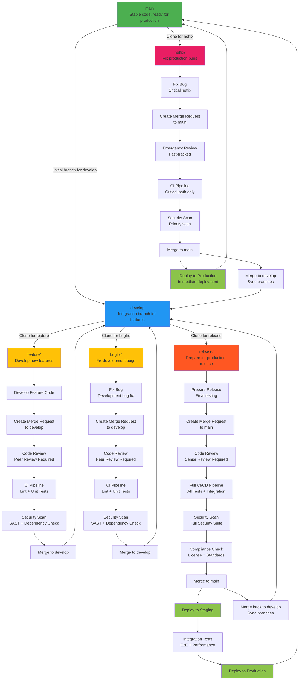

# GitLab Workflow Diagram

This diagram illustrates the GitLab workflow cycle, including branches, merge requests, and the initial branch for each type of request. It follows the Git Flow strategy.

## Enhanced Flowchart with CI/CD Stages

## Enhanced Workflow Explanation

### Branch Structure
- **main**: Production-ready code with comprehensive CI/CD pipeline
- **develop**: Integration branch with full testing suite
- **feature/**: Feature development with basic CI checks
- **bugfix/**: Development bug fixes with standard testing
- **release/**: Release preparation with full QA pipeline
- **hotfix/**: Critical production fixes with expedited process

### CI/CD Pipeline Stages
1. **Code Review**: Peer review for quality assurance
2. **Linting**: Code style and syntax checking
3. **Unit Tests**: Automated unit testing
4. **Security Scan**: SAST and dependency vulnerability checks
5. **Integration Tests**: End-to-end and performance testing
6. **Compliance Check**: License and standards validation

### Process Differences

**Hotfix vs Bugfix:**
- **Hotfix**: Emergency production fixes (highest priority)
  - Fast-tracked review process
  - Minimal CI pipeline for speed
  - Immediate production deployment
- **Bugfix**: Standard development fixes (normal priority)
  - Full review and testing cycle
  - Complete CI/CD pipeline
  - Follows normal release process

## Additional Enhancement Ideas

1. **Rollback Procedures**: Add automated rollback steps for failed deployments
2. **Monitoring Integration**: Include health checks and alerting after deployment
3. **Environment Progression**: Show staging → production deployment flow
4. **Automated Documentation**: Update docs automatically on releases
5. **Stakeholder Notifications**: Alert teams on deployment status
6. **Performance Monitoring**: Include APM and metrics collection
7. **Compliance Automation**: Add automated compliance checks
8. **Container Registry**: Show Docker image building and storage
9. **Database Migrations**: Include DB schema change management
10. **Feature Flags**: Show feature toggle management

Would you like me to implement any of these additional features?