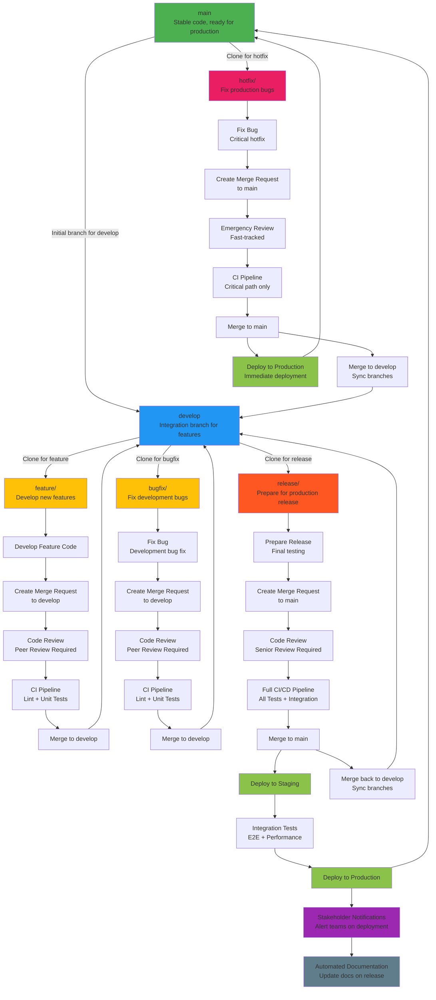

# GitLab Workflow Diagram - Simple Version

This is the simple version of the GitLab workflow, building on the current structure with basic additional steps: environment progression, stakeholder notifications, and automated documentation.

## Enhanced Flowchart with Basic Additions

## Key Additions in Simple Version
- **Environment Progression**: Clear staging to production flow
- **Stakeholder Notifications**: Automated alerts after deployment
- **Automated Documentation**: Docs updated automatically on releases
## Step-by-Step Workflow Explanation

### Branch Management
1. **A (main)**: Production branch containing stable, deployable code ready for production use.
2. **B (develop)**: Integration branch where features and bug fixes are merged before release.
3. **C (feature/)**: Branch for developing new features, cloned from develop.
4. **V (bugfix/)**: Branch for fixing bugs in development, cloned from develop.
5. **D (release/)**: Branch for preparing code for production release, cloned from develop.
6. **E (hotfix/)**: Branch for critical production fixes, cloned directly from main.

### Feature Development Flow
7. **F (Develop Feature Code)**: Write and test new feature code in the feature branch.
8. **G (Create Merge Request to develop)**: Submit code for review to merge into develop branch.
9. **H (Code Review - Peer Review Required)**: Team members review code for quality and standards.
10. **I (CI Pipeline - Lint + Unit Tests)**: Automated checks for code style and basic functionality.
11. **K (Merge to develop)**: Approved code is merged into develop branch.

### Bug Fix Flow
12. **W (Fix Bug - Development bug fix)**: Implement fix for development-related bugs.
13. **X (Create Merge Request to develop)**: Submit bug fix for review.
14. **Y (Code Review - Peer Review Required)**: Code review process for bug fixes.
15. **Z (CI Pipeline - Lint + Unit Tests)**: Basic automated testing for bug fixes.
16. **BB (Merge to develop)**: Merge approved bug fix into develop.

### Release Preparation Flow
17. **CC (Prepare Release - Final testing)**: Final testing and preparation before production.
18. **DD (Create Merge Request to main)**: Submit release for final approval.
19. **EE (Code Review - Senior Review Required)**: Senior team review for production readiness.
20. **FF (Full CI/CD Pipeline - All Tests + Integration)**: Comprehensive testing including integration.
21. **II (Merge to main)**: Release merged to production branch.
22. **JJ (Deploy to Staging)**: Deploy to staging environment for final validation.
23. **KK (Integration Tests - E2E + Performance)**: End-to-end and performance testing.
24. **LL (Deploy to Production)**: Final deployment to production environment.
25. **MM (Merge back to develop - Sync branches)**: Sync main changes back to develop.

### Hotfix Flow
26. **NN (Fix Bug - Critical hotfix)**: Implement critical production fix.
27. **OO (Create Merge Request to main)**: Emergency merge request for hotfix.
28. **PP (Emergency Review - Fast-tracked)**: Expedited review process for critical fixes.
29. **QQ (CI Pipeline - Critical path only)**: Minimal testing for urgent deployment.
30. **SS (Merge to main)**: Hotfix merged directly to production.
31. **TT (Merge to develop - Sync branches)**: Sync hotfix to develop branch.
32. **UU (Deploy to Production - Immediate deployment)**: Direct production deployment.

### Additional Features
33. **MMM (Stakeholder Notifications - Alert teams on deployment)**: Automated notifications to relevant teams.
34. **NNN (Automated Documentation - Update docs on release)**: Automatic documentation updates.